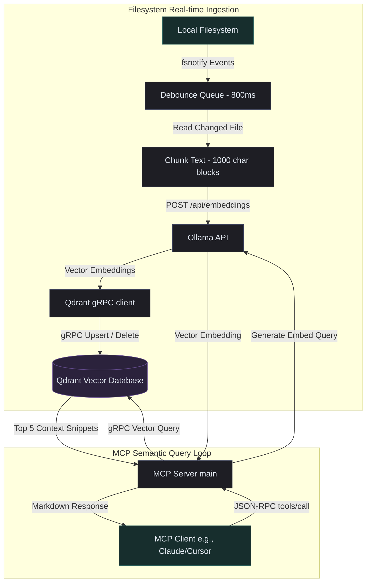

# Go Qdrant-RAG MCP Server

[](https://golang.org)
[](https://modelcontextprotocol.io)
[](https://qdrant.tech)

A high-performance **Model Context Protocol (MCP)** server written in Go that acts as a real-time Retrieval-Augmented Generation (RAG) agent for your codebases. 

This server recursively monitors your local files, auto-indexes changes in real-time using **Ollama** embeddings, stores them in a remote/local **Qdrant** vector database, and exposes a semantic vector search tool (`qdrant_search`) to your AI assistants (like Claude Desktop, Cursor, Windsurf, or Zed).

---

## 🏗️ Architecture

The server consists of two decoupled systems running concurrently:



---

## ✨ Key Features

- **⚡ Real-Time Indexing:** Uses OS-level file notifications (`fsnotify`) to watch your code workspace recursively. Any write, create, or delete operation immediately reflects in your vector database.
- **🛡️ Intelligent Ignoring & Filters:** Automatically avoids indexing large directories (like `node_modules` or `.git`) and temporary files. Includes configuration parameters to strictly exclude specific folders or whitelist particular hidden directories.
- **⏱️ Debounced Processing:** Features a configurable debounce duration (defaulting to 800ms) to ensure file saving sequences or git pulls do not thrash system/network resources.
- **🧠 Local Embeddings:** Harnesses **Ollama** embeddings (`/api/embeddings`) for localized, high-speed, and secure code representation.
- **⚡ Supercharged gRPC Storage:** Communicates with your **Qdrant** instance using native Go gRPC clients for ultra-low latency index operations.
- **🤖 Protocol Compliant:** Implements the latest **Model Context Protocol** spec. Keeps all internal execution logs redirected to `stderr` so that stdout is strictly reserved for clean JSON-RPC communication.

---

## ⚙️ Environment Variables

The server relies on the following environment variables for its configuration:

| Variable | Description | Default | Required |
|:---|:---|:---|:---:|
| `QDRANT_HOST` | IP address or hostname of your Qdrant instance. | `172.20.0.5` | No |
| `QDRANT_PORT` | The port of your Qdrant gRPC endpoint. | `6334` | No |
| `QDRANT_COLLECTION` | The Qdrant collection name to store the codebase vectors. | — | **Yes** |
| `WATCH_DIRECTORY` | The absolute path to the directory you want to watch and index. | — | **Yes** |
| `OLLAMA_HOST` | The base URL of your Ollama endpoint. | — | **Yes** |
| `EMBEDDING_MODEL` | The Ollama embedding model name (e.g., `nomic-embed-text`, `all-minilm`). | — | **Yes** |
| `EXCLUDE_DIRS` | Comma-separated directory names to ignore (e.g., `node_modules,vendor,dist`). | `""` | No |
| `INCLUDE_HIDDEN_DIRS` | Comma-separated hidden folder names to explicitly watch (e.g., `.github,.cursor`). | `""` | No |

---

## 🚀 Compilation & Installation

Ensure you have [Go](https://go.dev/doc/install) 1.25.0 or later installed.

### 1. Build the Binary
To compile the codebase into a single, high-performance static binary:

```bash
# Build with debug symbols stripped for maximum execution speed and minimal size
go build -ldflags="-s -w" -o ~/bin/qdrant-mcp-server main.go
```

Alternatively, you can build directly to your working directory:
```bash
go build -o qdrant-mcp-server main.go
```

---

## 🔌 Integration with MCP Clients

To use this server with your favorite AI agent tool, add it to your client's MCP configuration settings.

### Claude Desktop Integration
Add the following block to your `claude_desktop_config.json` (typically located at `~/.config/Claude/claude_desktop_config.json` on Linux/macOS or `%APPDATA%\Claude\claude_desktop_config.json` on Windows):

```json
{
  "mcpServers": {
    "qdrant-rag": {
      "command": "/absolute/path/to/bin/qdrant-mcp-server",
      "env": {
        "QDRANT_HOST": "172.20.0.5",
        "QDRANT_COLLECTION": "my-codebase-collection",
        "WATCH_DIRECTORY": "/home/user/Workspace/my-project",
        "OLLAMA_HOST": "http://127.0.0.1:11434",
        "EMBEDDING_MODEL": "nomic-embed-text",
        "EXCLUDE_DIRS": "node_modules,dist,bin,obj,.git",
        "INCLUDE_HIDDEN_DIRS": ".github"
      }
    }
  }
}
```

### Cursor & Windsurf Integration
1. Open your editor settings.
2. Navigate to **MCP** or **Model Context Protocol** settings.
3. Click **Add New MCP Server**.
4. Set the Type to `command` (or `stdio`).
5. Provide a name: `qdrant-rag`.
6. Provide the command command: `/absolute/path/to/bin/qdrant-mcp-server`.
7. Configure the environment variables list as shown in the JSON schema above.

---

## 📚 Codex / Knowledge Base Setup

Many developers maintain local documentation, architecture guidelines, team handbooks, or a personal knowledge base inside their repository or workspace using folders like `.codex` or `.obsidian`. 

By default, the server ignores all hidden directories (those starting with a `.`) to prevent performance bottlenecks. You can explicitly instruct the server to monitor, index, and query your Codex notes by adding `.codex` or `.obsidian` to the `INCLUDE_HIDDEN_DIRS` environment variable.

### Setup Example

Simply append your documentation directory to the `INCLUDE_HIDDEN_DIRS` variable in your MCP configuration:

```json
"env": {
  "WATCH_DIRECTORY": "/home/user/Workspace/my-project",
  "INCLUDE_HIDDEN_DIRS": ".codex,.obsidian",
  "QDRANT_COLLECTION": "my-project-vectors",
  "OLLAMA_HOST": "http://127.0.0.1:11434",
  "EMBEDDING_MODEL": "nomic-embed-text"
}
```

### 🧠 Benefits of indexing your Codex
Once configured, the MCP server automatically chunks and indexes your `.codex/*.md` documentation alongside your codebase. Your AI coding assistants can use the `qdrant_search` tool to:
* **Lookup Internal Design Guides:** *"Find the guidelines for writing telemetry logs."*
* **Retrieve Architecture Schemas:** *"What is the database connection strategy documented in the wiki?"*
* **Reference Feature Specifications:** *"How should the new user-onboarding flows behave according to our Codex specs?"*

---

## 🛠️ Provided Tools

### `qdrant_search`
Performs semantic vector-based searches across the entire watched workspace directory.

**Arguments:**
- `query` (string, Required): The natural language query or concept you are searching for.

**Example Client Call:**
```json
{
  "name": "qdrant_search",
  "arguments": {
    "query": "JWT token parsing middleware with custom claim validation"
  }
}
```

**Markdown Response Structure:**
The tool generates a rich, aggregated Markdown response containing up to 5 matching codebase snippets, including match scores, absolute file paths, and syntax-highlighted code blocks for the appropriate programming language:

````markdown
### Core Codebase Reference Snippets for: "JWT token parsing middleware with custom claim validation"

#### [1] Source File: /home/user/Workspace/my-project/auth/middleware.go (Match Score: 0.92)
```go
package auth

import (
    "github.com/golang-jwt/jwt/v5"
    // ...
)

func ValidateCustomClaims(tokenString string) (*Claims, error) {
    // ...
}
```
````

---

### `get_sync_status`
Retrieves the real-time status of the codebase vector ingestion pipeline, including the status state, pending queue size, active indexing threads, and the total count of successfully synced files during the session lifecycle.

**Arguments:**
*None*

**Example Client Call:**
```json
{
  "name": "get_sync_status"
}
```

**Markdown Response Structure:**
```markdown
### 🔄 Code Ingestion Sync Status

- **Status:** `syncing`
- **Queue Size (Debouncing):** `2`
- **Active Indexing Threads:** `1`
- **Lifetime Synced Files:** `24`

#### ⏳ Files Currently in Debounce Queue:
- `/home/user/Workspace/my-project/auth/middleware.go`
- `/home/user/Workspace/my-project/models/user.go`
```

---

## 📜 License

[MIT License](LICENSE)