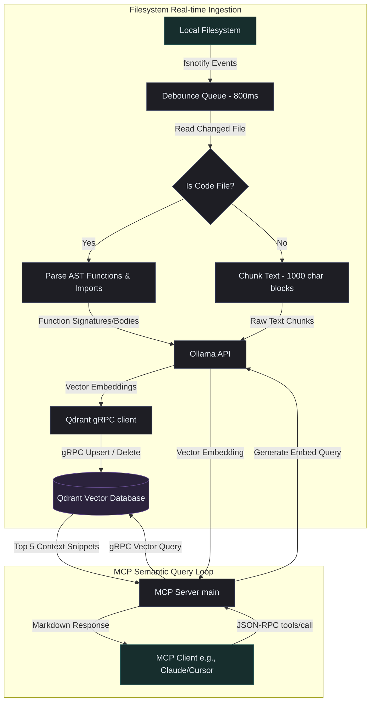

# Go Qdrant-RAG MCP Server

[](https://golang.org)
[](https://modelcontextprotocol.io)
[](https://qdrant.tech)

A high-performance **Model Context Protocol (MCP)** server written in Go that acts as a real-time Retrieval-Augmented Generation (RAG) agent for your codebases. 

This server recursively monitors your local files, auto-indexes changes in real-time using **Ollama** embeddings, stores them in a remote/local **Qdrant** vector database, and exposes a semantic vector search tool (`qdrant_search`) to your AI assistants (like Claude Desktop, Cursor, Windsurf, or Zed).

---

## 🏗️ Architecture

The server consists of two decoupled systems running concurrently:



---

## ✨ Key Features

- **🧠 AST-Aware Code Intelligence:** Uses tree-sitter AST parsers for Go, JavaScript, TypeScript, PHP, C#, and Python to extract and embed precise function blocks, capturing receivers, signatures, and exact line maps (`start_line`/`end_line`) for deep semantic code searching.
- **⚡ Concurrent Rate-Limited Ingestion:** Accelerates workspace indexing by walking and parsing files concurrently using Goroutines and `sync.WaitGroup` while preventing Ollama server overload via a configurable buffered semaphore pool (`MAX_EMBEDDING_WORKERS`).
- **⚡ Real-Time Indexing:** Uses OS-level file notifications (`fsnotify`) to watch your code workspace recursively. Any write, create, or delete operation immediately reflects in your vector database.
- **🛡️ Intelligent Ignoring & Filters:** Automatically respects your `.gitignore` files recursively across the workspace, skipping untracked files and folders (like build artifacts or node modules) instantly during crawling and watch events. Also includes fallback configuration parameters to strictly exclude additional folders or whitelist particular hidden directories.
- **⏱️ Debounced Processing:** Features a configurable debounce duration (defaulting to 800ms) to ensure file saving sequences or git pulls do not thrash system/network resources.
- **🧠 Local Embeddings:** Harnesses **Ollama** embeddings (`/api/embeddings`) for localized, high-speed, and secure code representation.
- **⚡ Supercharged gRPC Storage:** Communicates with your **Qdrant** instance using native Go gRPC clients for ultra-low latency index operations.
- **🤖 Protocol Compliant:** Implements the latest **Model Context Protocol** spec. Keeps all internal execution logs redirected to `stderr` so that stdout is strictly reserved for clean JSON-RPC communication.

---

## ⚙️ Environment Variables

The server relies on the following environment variables for its configuration:

| Variable | Description | Default | Required |
|:---|:---|:---|:---:|
| `QDRANT_HOST` | IP address or hostname of your Qdrant instance. | `172.20.0.5` | No |
| `QDRANT_PORT` | The port of your Qdrant gRPC endpoint. | `6334` | No |
| `QDRANT_COLLECTION` | The Qdrant collection name to store the codebase vectors. | — | **Yes** |
| `WATCH_DIRECTORY` | The absolute path to the directory you want to watch and index. | — | **Yes** |
| `OLLAMA_HOST` | The base URL of your Ollama endpoint. | — | **Yes** |
| `EMBEDDING_MODEL` | The Ollama embedding model name (e.g., `nomic-embed-text`, `all-minilm`). | — | **Yes** |
| `EXCLUDE_DIRS` | Comma-separated directory names to ignore (e.g., `node_modules,vendor,dist`). | `""` | No |
| `INCLUDE_HIDDEN_DIRS` | Comma-separated hidden folder names to explicitly watch (e.g., `.github,.cursor`). | `""` | No |
| `PARSER_MODE` | Parsing mode: `code` (only AST), `doc` (only documents), or `full` (both). | `full` | No |
| `MAX_EMBEDDING_WORKERS` | Max concurrent worker threads doing Ollama embeddings. | `5` | No |
| `BATCH_SIZE` | Batch size for vector upserts. | `100` | No |
| `BATCH_TIMEOUT` | Batch timeout for vector upserts (e.g. `200ms`, `1s`). | `200ms` | No |
| `LOG_TO_FILE` | Enable logging to `.qdrant-mcp-server.log` physical file. | `false` | No |
| `SEARCH_MODE` | Vector search mode: `dense` (pure semantic), `sparse` (precise keyword), or `hybrid` (dense + sparse combined using Reciprocal Rank Fusion RRF). | `dense` | No |

---

## 🚀 Installation & Compilation

### Direct One-Line Installation
If you simply want to install the pre-compiled binary on your client machine (supports Linux, macOS, and Windows/WSL), you can run the following command directly:

```bash
curl -fsSL https://raw.githubusercontent.com/weverkley/qdrant-mcp-server/main/install.sh | sh
```

To install a specific version, pass the `VERSION` environment variable:
```bash
curl -fsSL https://raw.githubusercontent.com/weverkley/qdrant-mcp-server/main/install.sh | VERSION=v1.0.0 sh
```

> [!TIP]
> **Automated PATH Setup**: If the installer does not have write permissions to `/usr/local/bin`, it will fallback to installing in `~/.local/bin` and automatically append the path export to your shell configuration profile (`~/.bashrc`, `~/.zshrc`, `~/.profile`, or `~/.bash_profile`) so the CLI is immediately available after terminal restart.

---

### Manual Compilation
Ensure you have [Go](https://go.dev/doc/install) 1.25.0 or later installed.

To compile the codebase into a single, high-performance static binary:

```bash
# Build with debug symbols stripped for maximum execution speed and minimal size
go build -ldflags="-s -w" -o ~/bin/qdrant-mcp-server main.go
```

Alternatively, you can build directly to your working directory:
```bash
go build -o qdrant-mcp-server main.go
```

---

## 🤖 Smart CLI & Manual Ingestion

The `qdrant-mcp-server` binary itself is a highly functional command-line tool. While it is designed to run automatically as a background process via your AI editor, you can also run manual operations—like bulk codebase ingestion—directly from your shell.

This is especially helpful when indexing extremely large codebases for the first time, as doing it in the background can sometimes feel slow or resource-intensive.

### ⏱️ Auto-Discovery & Zero-Config CLI
When running CLI subcommands (like `ingest`), the server automatically looks up your existing agent environment variables by searching upwards from the current working directory for configuration files:
- `.mcp.json` / `mcp.json`
- `.claude/settings.local.json`
- `.codex/config.toml` / `config.toml`

It also checks your user-level Claude settings file:
- `~/.claude/settings.json`

If it finds one of these configurations, it automatically parses it and loads the configured environment variables (like `QDRANT_COLLECTION`, `WATCH_DIRECTORY`, `OLLAMA_HOST`, and `EMBEDDING_MODEL`) into the active session. This means you can run manual ingestions inside your project folder with **zero manual configuration**!

```bash
# Simply navigate to your project and run:
qdrant-mcp-server ingest
```

### 🎛️ Explicit CLI Overrides & Standalone Mode
If you want to run the tool standalone, or override specific variables on the fly, you can pass command-line arguments (parameters):

```bash
# Explicitly set collection and directory to index
qdrant-mcp-server ingest --collection my-custom-collection --watch-dir ./src --ollama http://localhost:11434

# Use shorthand flags
qdrant-mcp-server ingest -c my-collection -w ./ -o http://172.20.0.5:11434 -e nomic-embed-text
```

### 📋 Supported CLI Flags:
- `--collection`, `-c <name>`: Qdrant collection name (`QDRANT_COLLECTION`)
- `--watch-dir`, `-w <path>`: Directory to watch/index (`WATCH_DIRECTORY`)
- `--ollama`, `-o <url>`: Ollama API URL (`OLLAMA_HOST`)
- `--embedding`, `-e <model>`: Ollama embedding model (`EMBEDDING_MODEL`)
- `--qdrant-host`, `-qh <host>`: Qdrant gRPC host (`QDRANT_HOST`)
- `--qdrant-port`, `-qp <port>`: Qdrant gRPC port (`QDRANT_PORT`)
- `--exclude-dirs`, `-xd <list>`: Comma-separated directory names to ignore (`EXCLUDE_DIRS`)
- `--include-hidden-dirs`, `-ihd <list>`: Comma-separated hidden directories to watch (`INCLUDE_HIDDEN_DIRS`)
- `--parser-mode`, `-pm <mode>`: Parsing mode: `code`, `doc`, or `full` (`PARSER_MODE`)
- `--max-workers`, `-mw <number>`: Max concurrent embedding workers (`MAX_EMBEDDING_WORKERS`)
- --batch-size, -bs <number>: Batch size for vector upserts (`BATCH_SIZE`, default: 100)
- --batch-timeout, -bt <duration>: Batch timeout for vector upserts (`BATCH_TIMEOUT`, default: 200ms)
- --log-to-file, -lf <bool>: Enable log output to physical file (`LOG_TO_FILE`, default: false)
- --search-mode, -sm <mode>: Vector search mode: `dense`, `sparse`, or `hybrid` (`SEARCH_MODE`, default: dense)

---

## 🎓 Installing Agent Skills

To help your AI agent (like Cursor, Windsurf, Cline, or Copilot) understand when and how to use the semantic search capabilities, you can install specialized **skills** (rules files) directly into your workspace.

Run the compiled server binary with the `list-skills` and `install-skill` subcommands:

### 1. List Supported Skills
```bash
./qdrant-mcp-server list-skills
```

### 2. Install a Skill for an Agent
Install the rules directly in your active project's root folder:
```bash
# Install Cursor rules (.cursorrules)
./qdrant-mcp-server install-skill cursor

# Install Cline rules (.clinerules)
./qdrant-mcp-server install-skill cline

# Install Copilot instructions (.github/copilot-instructions.md)
./qdrant-mcp-server install-skill copilot

# Install Codex instructions (.codex/mcp-instructions.md)
./qdrant-mcp-server install-skill codex

# Install ALL supported agent skills at once
./qdrant-mcp-server install-skill all
```

You can also specify a custom target path as the last parameter:
```bash
./qdrant-mcp-server install-skill cursor /absolute/path/to/my-project
```

---

## 🔌 Integration with MCP Clients

To use this server with your favorite AI agent tool, add it to your client's MCP configuration settings.

### Claude Desktop Integration
Add the following block to your `claude_desktop_config.json` (typically located at `~/.config/Claude/claude_desktop_config.json` on Linux/macOS or `%APPDATA%\Claude\claude_desktop_config.json` on Windows):

```json
{
  "mcpServers": {
    "qdrant-rag": {
      "command": "/usr/local/bin/qdrant-mcp-server",
      "env": {
        "QDRANT_HOST": "172.20.0.5",
        "QDRANT_COLLECTION": "my-codebase-collection",
        "WATCH_DIRECTORY": "/home/user/Workspace/my-project",
        "OLLAMA_HOST": "http://127.0.0.1:11434",
        "EMBEDDING_MODEL": "nomic-embed-text",
        "EXCLUDE_DIRS": "node_modules,dist,bin,obj,.git",
        "INCLUDE_HIDDEN_DIRS": ".github"
      }
    }
  }
}
```

> [!NOTE]
> - **Direct Installer**: If you installed using the one-line `curl` command, the path is `/usr/local/bin/qdrant-mcp-server` (or `/home/<username>/.local/bin/qdrant-mcp-server` if installed as a non-root fallback).
> - **Manual Compilation**: If you compiled it manually, specify the path where you saved the binary (e.g., `/home/<username>/bin/qdrant-mcp-server` or the absolute path to your working directory build).

### Cursor & Windsurf Integration
1. Open your editor settings.
2. Navigate to **MCP** or **Model Context Protocol** settings.
3. Click **Add New MCP Server**.
4. Set the Type to `command` (or `stdio`).
5. Provide a name: `qdrant-rag`.
6. Provide the command: `/usr/local/bin/qdrant-mcp-server` (update this path to match your installation path: `/usr/local/bin/qdrant-mcp-server`, `/home/<username>/.local/bin/qdrant-mcp-server`, or `/home/<username>/bin/qdrant-mcp-server` depending on how you installed or built it).
7. Configure the environment variables list as shown in the JSON schema above.

---

## 📚 Codex / Knowledge Base Setup

Many developers maintain local documentation, architecture guidelines, team handbooks, or a personal knowledge base inside their repository or workspace using folders like `.codex` or `.obsidian`. 

By default, the server ignores all hidden directories (those starting with a `.`) to prevent performance bottlenecks. You can explicitly instruct the server to monitor, index, and query your Codex notes by adding `.codex` or `.obsidian` to the `INCLUDE_HIDDEN_DIRS` environment variable.

### Setup Example

Simply append your documentation directory to the `INCLUDE_HIDDEN_DIRS` variable in your MCP configuration:

```json
"env": {
  "WATCH_DIRECTORY": "/home/user/Workspace/my-project",
  "INCLUDE_HIDDEN_DIRS": ".codex,.obsidian",
  "QDRANT_COLLECTION": "my-project-vectors",
  "OLLAMA_HOST": "http://127.0.0.1:11434",
  "EMBEDDING_MODEL": "nomic-embed-text"
}
```

### 🧠 Benefits of indexing your Codex
Once configured, the MCP server automatically chunks and indexes your `.codex/*.md` documentation alongside your codebase. Your AI coding assistants can use the `qdrant_search` tool to:
* **Lookup Internal Design Guides:** *"Find the guidelines for writing telemetry logs."*
* **Retrieve Architecture Schemas:** *"What is the database connection strategy documented in the wiki?"*
* **Reference Feature Specifications:** *"How should the new user-onboarding flows behave according to our Codex specs?"*

---

## 🎯 Stop-Words Filtering (Multilingual & Custom)

When using **sparse** or **hybrid** search modes, the server computes sparse vectors (using a state-free TF-IDF/BM25 approximation with FNV-1a token hashing). To guarantee extremely high-quality exact keyword lookups and prevent common grammatical noise from polluting your vector index, the server features a comprehensive stop-words filtering engine.

### 🌐 Built-in Multilingual Support
Out of the box, the server identifies and automatically excludes grammatical noise, prepositions, articles, and pronouns across multiple Western European languages:
- **English**: `the`, `a`, `and`, `or`, `but`, `for`, `with`, `about`, `against`...
- **Spanish**: `el`, `la`, `los`, `las`, `un`, `una`, `de`, `del`, `con`, `por`, `para`, `que`...
- **Portuguese**: `uma`, `da`, `dos`, `ao`, `na`, `ou`, `mais`, `lhe`, `seu`, `sua`, `com`...
- **German**: `der`, `die`, `und`, `oder`, `mit`, `von`, `zu`, `auf`, `bei`, `für`, `gegen`...
- **French**: `une`, `du`, `au`, `dans`, `par`, `pour`, `avec`, `car`, `son`, `ses`...
- **Italian**: `gli`, `dello`, `della`, `dei`, `col`, `perché`, `questo`, `quello`...

This keeps sparse index weights highly focused on meaningful keywords even when operating in multilingual environments or indexing localized codebase documentation.

### 🛠️ Workspace-Level Custom Stop-Words
For project-specific rules—like ignoring boilerplate framework imports, common logging verbs, or package namespaces—you can place a custom `.mcp-stopwords` file directly in the root of your configured `WATCH_DIRECTORY`.

#### How it works:
1. Create a file named `.mcp-stopwords` in your active project root.
2. Add one stop-word per line.
3. Blank lines and lines starting with `#` are treated as comments and skipped automatically.

#### Example `.mcp-stopwords` file:
```text
# Ignore boilerplate framework/namespace keywords
import
package
func
namespace

# Project-specific common keywords
logger
err
ctx
fmt
```

On startup or codebase crawl, the server automatically reads the `.mcp-stopwords` file, merging those custom entries into the active indexing and query search filtering pipelines.

---

## 🛠️ Provided Tools

### `qdrant_search`
Performs semantic vector-based searches across the entire watched workspace directory.

**Arguments:**
- `query` (string, Required): The natural language query or concept you are searching for.
- `file_extensions` (array of strings, Optional): Restrict search to specific extensions (e.g. `["go", "py"]`).
- `path_prefix` (string, Optional): Restrict search to a specific directory (e.g. `src/auth`).

**Example Client Call (with Advanced Filtering):**
```json
{
  "name": "qdrant_search",
  "arguments": {
    "query": "JWT token parsing middleware with custom claim validation",
    "file_extensions": ["go"],
    "path_prefix": "src/auth"
  }
}
```

**Markdown Response Structure:**
The tool generates a rich, aggregated Markdown response containing up to 5 matching codebase snippets, recognizing and formatting AST function-level metadata (receivers, function names, line ranges) and structured document page numbers:

````markdown
### Core Codebase Reference Snippets for: "JWT token parsing middleware with custom claim validation"

#### [1] Function: `ValidateCustomClaims` in /home/user/Workspace/my-project/auth/middleware.go (Lines 12-32) (Match Score: 0.92 | Last Synced: 2026-05-23 09:28:10)
```go
func ValidateCustomClaims(tokenString string) (*Claims, error) {
    // ...
}
```

#### [2] Doc Chunk (Page/Section 3) in /home/user/Workspace/my-project/docs/auth-specs.md (Match Score: 0.88 | Last Synced: 2026-05-23 09:28:10)
```markdown
JWT token claims are validated against the current session lifecycle policy...
```
````

---

### `get_sync_status`
Retrieves the real-time status of the codebase vector ingestion pipeline, including the status state, pending queue size, active indexing threads, and the total count of successfully synced files during the session lifecycle.

**Arguments:**
*None*

**Example Client Call:**
```json
{
  "name": "get_sync_status"
}
```

**Markdown Response Structure:**
```markdown
### 🔄 Code Ingestion Sync Status

- **Status:** `syncing`
- **Queue Size (Debouncing):** `2`
- **Active Indexing Threads:** `1`
- **Lifetime Synced Files:** `24`

#### ⏳ Files Currently in Debounce Queue:
- `/home/user/Workspace/my-project/auth/middleware.go`
- `/home/user/Workspace/my-project/models/user.go`
```

---

## 📦 Automated Releases & CI/CD

This repository includes a fully automated release workflow powered by GitHub Actions. 

### Triggering a Release
The release process is manual and can be triggered at any time using GitHub's `workflow_dispatch`:

1. Navigate to the **Actions** tab in your GitHub repository.
2. Select the **Build and Release** workflow from the left sidebar.
3. Click the **Run workflow** dropdown on the right.
4. Input the target release version tag (e.g. `v1.0.0`) and click **Run workflow**.

### What the Release Workflow Does:
- **Verification**: Automatically checks Go module dependencies and runs the Go test suites before any builds are triggered.
- **Cross-Compilation**: Compiles native binaries in parallel using a matrix strategy for multiple architectures:
  - **Linux**: `amd64`, `arm64`
  - **macOS (Darwin)**: `amd64`, `arm64`
  - **Windows**: `amd64`
- **Dynamic Versioning**: Injects the exact version tag inputted by the user at build time into the application binary using `-ldflags="-X main.Version=<VERSION> -s -w"`.
- **Packaging**: Packs each compiled binary into `.tar.gz` archives (for Linux/macOS) and `.zip` archives (for Windows).
- **GitHub Release & Assets**: Automatically checks if the git tag exists (creates and pushes it if it does not), creates a new public GitHub release, generates release notes from recent commit history, and attaches all compressed archives as downloadable assets.

---

## 📜 License

[MIT License](LICENSE)